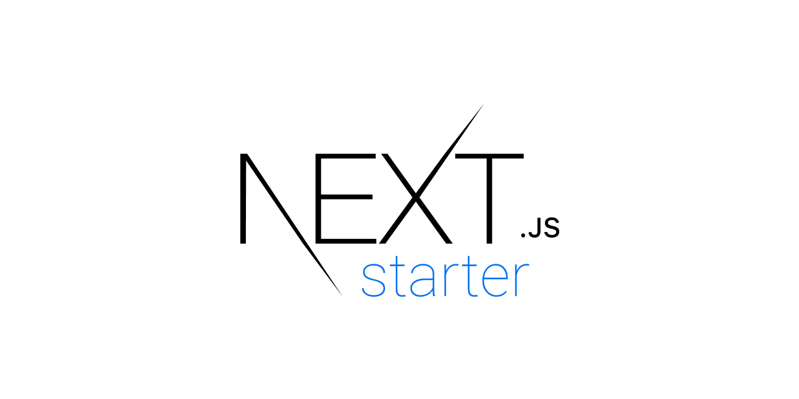

# ⏭ next.js starter

_A base starter with formatting, linting, serverless, CSS in JS, and SEO included._

[![vercel][vercel-badge]][vercel]
[![github actions][github-actions-badge]][github-actions]
[![codecov][codecov-badge]][codecov]
[![contributing][contributing-badge]][contributing]
[![contributors][contributors-badge]][contributors]

    

[vercel]: https://vercel.com/piperguy/next-starter
[vercel-badge]: https://img.shields.io/github/deployments/piperguy/next-starter/production?label=vercel&style=flat-square
[github-actions]: https://github.com/piperguy/next-starter/actions
[github-actions-badge]: https://img.shields.io/github/workflow/status/piperguy/next-starter/%F0%9F%A7%AA%20test?style=flat-square
[codecov]: https://app.codecov.io/gh/piperguy/next-starter
[codecov-badge]: https://img.shields.io/codecov/c/github/piperguy/next-starter?style=flat-square
[contributing]: https://github.com/piperguy/next-starter/blob/master/contributing.md
[contributing-badge]: https://img.shields.io/badge/PRs-welcome-success?style=flat-square
[contributors]: #-Contributors
[contributors-badge]: https://img.shields.io/github/all-contributors/piperguy/next-starter?style=flat-square
